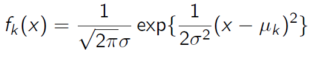
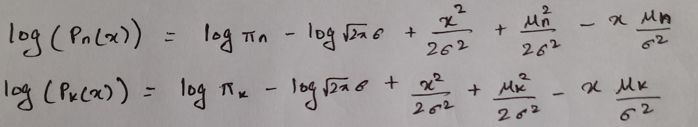
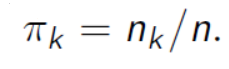
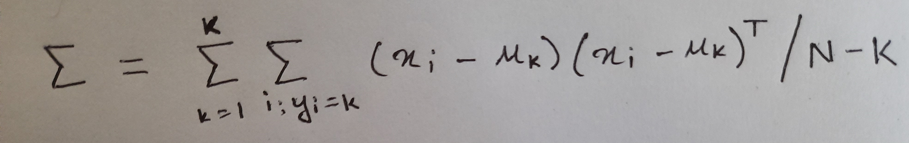
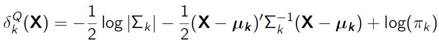
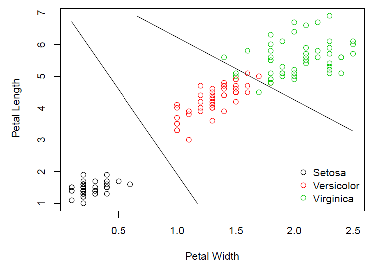
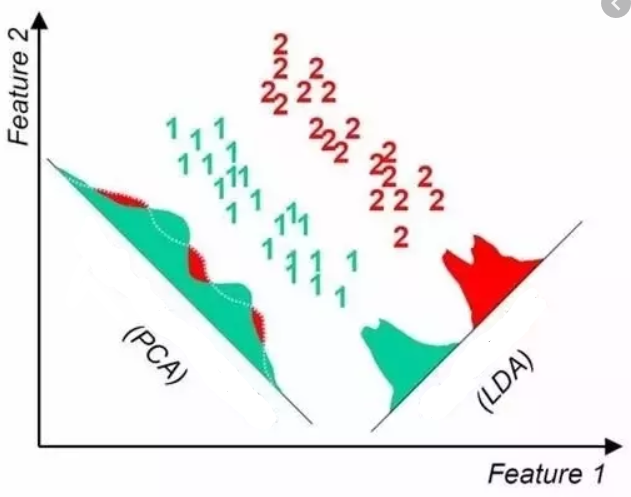

# What is LDA?

LDA stands for Linear Discriminant Analysis and is a type of classification algorithm. It is based on bayes theorem and distribution of data. The fundamental difference between LDA and Logistic regression is that Logistic regression directly models the probability of a data point being in a certain class: 
**P(y=k|X=x)**  
whereas the LDA classifier tries to find this probability using the Bayes theorem

# LDA Classifier
Before moving on let us revisit the Baye's Theorem

Now we will see a restructured version of this to suit our task of classification

The left hand side of this formula is interpreted as: Probability of a data point being in class k if its features are x. It will be refered to using Pk(x). 
Lets break down the right hand side and compare it with the original Bayes Theorem
* πk corresponds to P(A) which is the probability of occurence of class k in your data.
* fk(x) is the probability of occurence of x in class k. To find this we need to know the distribution of the data.
* The denominator of course corresponds to P(B). As the features x may not be unique to just class k and occur in any of the classes,
  it is denoted by a weighted sum as shown.

The task at hand is to find fk(x) or the distribution of data in your dataset which can also tell the probability. We shall proceed with the assumption that it is a normal distribution. Lets see what a normal distribution looks like.
**Lets assume that there is only one feature and based on that we are doing the classification**. So if the values in the feature were to be distributed normally and normalised, it would look something like

The equation of this graph is:

* μk is the average of all x belonging to class k
* σ2k is the variance of all x belonging to class k. **The assumption of LDA is that the variance of all classes is equal and so we can refer to it as just σ2**. 
After knowing all these values, we need to plug it into Pk(x) and find its value for each k. The class corresponding to the highest value is the class to which this particular data-point belongs to. Lets compare the values for two arbitrary classes and see if we can conclude something.

We see that the denominators are the same so we need to only compare the numerators. Lets take the log and instead compare the log values as that simplifies things

After cancelling the the common terms in both the equations, we are left with a relatively simple expression we actually need to compute and compare so determine which class the data-point belongs to. **Remember the x here is the features of the test data point**. This is the value we need to calculate for each class and is given by

We can see that this expression is linear with respect to x and so the whole process is called Linear Discriminant Analysis. To figure out the class, the ẟk(x) values for two classes is compared with an inequality sign and this inequaity gives the decision boundary between two classes which is linear in this case. ẟk(x) is called the **Linear Discriminant function** 
Now all that is left to do is estimate the values of μk, σ2 and πk. We have just assumed that the distribution is gaussian which gave us the above equation, but these values are still yet to be known. The estimates of these values are given by

* μk is the average of x over each class
* σ2 is like a weighted average of the variance of each class
* πk is the fraction of data belonging to class k in the training set
* N is the number of points in the training set and K is the number of dictinct classes 
These values are plugged into ẟk(x) along with x and computed for each class and compared 

Now if the number of features is more than one, the concept remains the same, only some changes in the variables. 
* μk is a vector of means of the average of each feature in the class k
* σ2 is now a covariance matrix and represented by Σ which is again assumed to be the same for each class.

Remember that x and μk are now vectors and the T means transpose. Now the generalised Linear discriminant function is  

# QDA Classifier
And thats LDA done. Lets quickly look at something more interesting. LDA gives us only linear boundaries which will not always be good enough to separate the data. The culprit behind this is our assumption of the variance or the covariance to be equal for all classes because of which the quadratic term was a common term and cancelled out. What if we do not make this assumption and generalise LDA. This is what is called Quadratic Discriminant Analysis or QDA.
Nothing new to learn in QDA, just that we cannot cancel the X2 term and so our discriminant function is now a little different. It is now called the **Quadratic Discriminant Function** and is represented by 

You can see that this expression is no longer linear with respect to X. 
Lets see the difference in performance of LDA and QDA on the Iris dataset by drawing the decision boundary.

                                                

We can see that in this case QDA(the second picture) does a slightly better job with the decision boundary of Versicolor and Virginica.

# LDA Dimensionality Reduction
In sklearn, you will find that LDA also is a method of dimensionality reduction. Let us quickly look at that as well. 
This is not a classification algorithm and is not related to the above explanation, it is a way of transforming the feature space into a lower dimensional space and then the user is free to use more robust classification algorithms like RandomForest on this compressed data. 

**But how is this different from PCA?** 
The basic aim of PCA is to project the Data into a new axis that captures the variance of the data. The aim of the LDA dimensionality reduction technique is to project the Data into a new axis that ehnances the separatiblity of the classes. The Picture given below should make it clear.

So PCA does not take into account the class labels, just tries to project the whole data onto a meaningful axis that explains its variance, where as LDA is concerned about the class labels and tries to maximise separatibility. Normally you would use PCA first if required to get rid of multicollinearity and other issues and then perform a LDA reduction before passing it on to some classification algorithm
