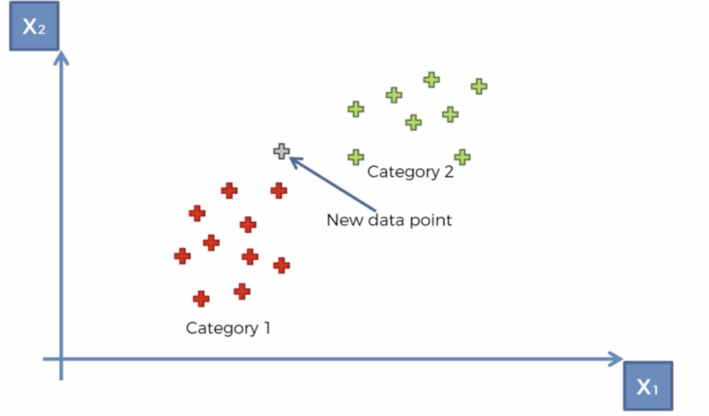

**What&#39;s KNN?**

KNN (K-Nearest Neighbours) is one of many supervised learning algorithms used in machine learning, it&#39;s a classifier algorithm (can be used in regression problems also) where the learning is based &quot;how similar&quot; data (vector) is from each other.

**How does it work?**

The KNN is pretty simple, imagine that you have a data about tumours

- Benign Tumours (Represented by Green Plus)
- Malignant Tumours (Represented by Red Plus)
- And a tumour we wish to classify (Represented by Grey Plus)

So, the machine has all the characteristics (data) regarding the tumour, but doesn&#39;t know the final label and it has to determine whether the tumour is malignant or benign.

The algorithm for KNN is as follows:

1. Receive an unclassified data.
2. Measure the Euclidean Distance from the new data to all other data that is already classified.

1. Get the K (K is a parameter that we define) smallest distances.
2. Check the list of classes had the shortest distance and count the number of times each class appears.

1. Take the correct class as the class that appeared the most times. So, in this case the unknown datapoint will be classified as Category 1 or Malignant Tumour.
2. In our case, we defined the value of K=5, and three of the closest neighbours are from Category 1 and two of them are from Category 2. So the unknown data point is classified as one of Category 1.
