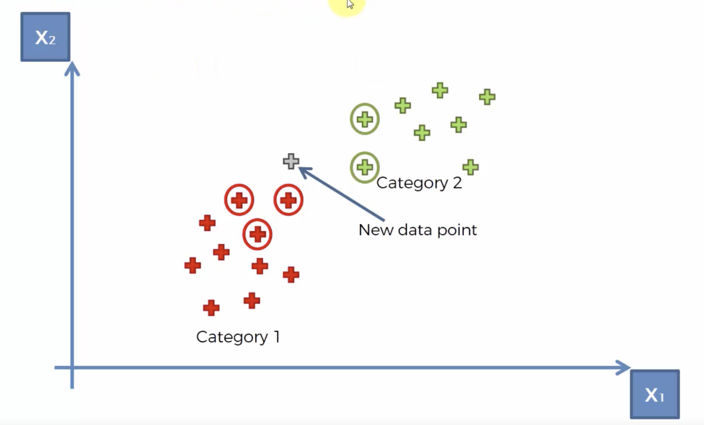
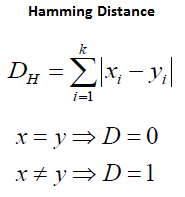

## **Introduction to KNN**

KNN (K-Nearest Neighbours) is one of many supervised learning algorithms used in machine learning. KNN algorithm can be used for Regression as well as for Classification but mostly it is used for the Classification problems.

It&#39;s a classifier algorithm (can be used in regression problems also) where the learning is based on &quot;how similar&quot; data (vector) is from each other. It&#39;s easy to implement and understand, but has a major drawback of becoming significantly slow as the size of that data in use grows.

The KNN algorithm assumes that similar things exist in close proximity. In other words, similar things are near to each other.

## **How does it work?**

The KNN is pretty simple, imagine that you have a data about tumours

- Benign Tumours (Represented by Green Plus)
- Malignant Tumours (Represented by Red Plus)
- And a tumour we wish to classify (Represented by Grey Plus)

So, the machine has all the characteristics (data) regarding the tumour, but doesn&#39;t know the final label and it has to determine whether the tumour is malignant or benign.

The algorithm for KNN is as follows:

1. Receive an unclassified data.
2. Measure the Euclidean Distance from the new data to all other data that is already classified.

3. Get the K (K is a parameter that we define) smallest distances.
4. Check the list of classes had the shortest distance and count the number of times each class appears.

5. Take the correct class as the class that appeared the most times. So, in this case the unknown datapoint will be classified as Category 1 or Malignant Tumour.
6. In our case, we defined the value of K=5, and three of the closest neighbours are from Category 1 and two of them are from Category 2. So the unknown data point is classified as one of Category 1.

## **KNN  for Regression**

 A simple implementation of KNN regression is to calculate the numerical average of the K nearest neighbors. Another approach uses an inverse distance weighted average of the K nearest neighbors. KNN regression uses the same distance functions as KNN classification.
 

## **Choosing the right value for K**

To select the K that&#39;s right for your data, we run the KNN algorithm several times with different values of K and choose the K that reduces the number of errors we encounter while maintaining the algorithm&#39;s ability to accurately make predictions when it&#39;s given data it hasn&#39;t seen before.

Here are some things to keep in mind:

1. As we decrease the value of K to 1, our predictions become less stable. Just think for a minute, imagine K=1 and we have a query point surrounded by several reds and one green, but the green is the single nearest neighbor. Reasonably, we would think the query point is most likely red, but because K=1, KNN incorrectly predicts that the query point is green.

1. Inversely, as we increase the value of K, our predictions become more stable due to majority voting / averaging, and thus, more likely to make more accurate predictions (up to a certain point). Eventually, we begin to witness that the accuracy starts decreasing. It is at this point we know we have pushed the value of K too far.

1. In cases where we are taking a majority vote among labels, we usually make K an odd number to have a tiebreaker.

  

## **Things to keep in mind during implementation**

- **Normalizing Data:** The algorithm directly calculates distances between the variables.In the case where variables have different measurement scales or there is a mixture of numerical and categorical variables. For example, if one variable is based on annual income in dollars, and the other is based on age in years then income will have a much higher influence on the distance calculated. One solution is to normalize the training set.
- **Address Missing Data** : Missing data will mean that the distance between samples can not be calculated. These samples could be excluded or the missing values could be imputed.
- **Curse of Dimensionality:** KNN works well with a small number of input variables (p), but struggles when the number of inputs is very large. In high dimensions, points that may be similar may have very large distances. All points will be far away from each other and our intuition for distances in simple 2 and 3-dimensional spaces breaks down. Apply dimensionality reduction on the data before applying KNN.
- Experiment with different values of K and choose the value such that the accuracy on the test set is maximum.
- Instead of using Euclidean Distance to calculate similarity we can use other distance metrics such as:

  

For categorical variables we can use Hamming Distance which is defined as:

  

## **Summary**

Thus KNN is quite easy to understand. The main advantages of using this algorithm is that it is quite simple to implement and there is no need for training the data. It stores the training dataset and learns from it only at the time of making real time predictions. This makes the KNN algorithm much faster than other algorithms that require training e.g. SVM, Linear Regression etc.

The main disadvantages are that when dealing with high dimensional data, it becomes difficult for the algorithm to calculate the distance in each dimension. KNN is sensitive to noise in the dataset. We need to manually impute missing values and remove outliers.