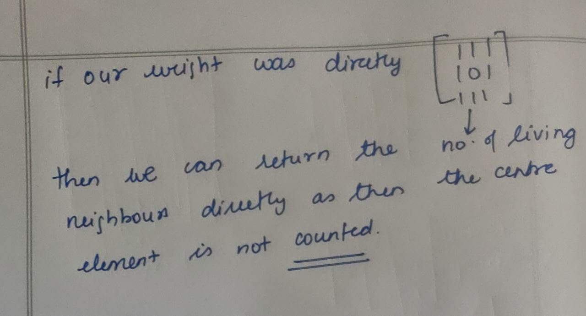
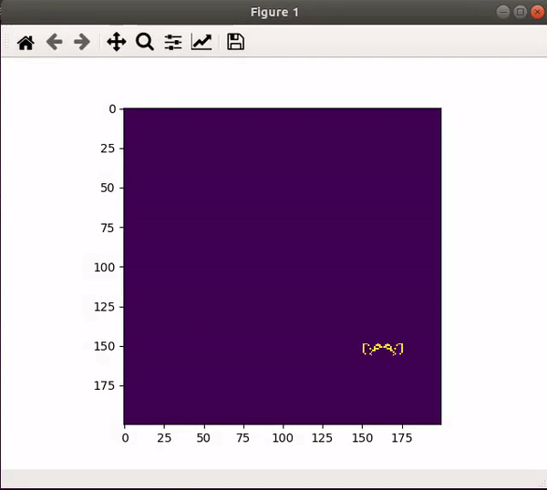
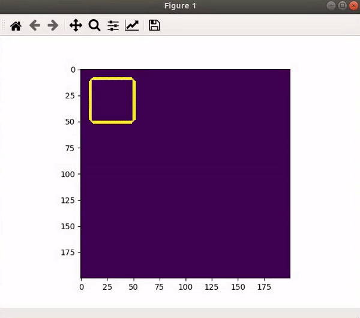
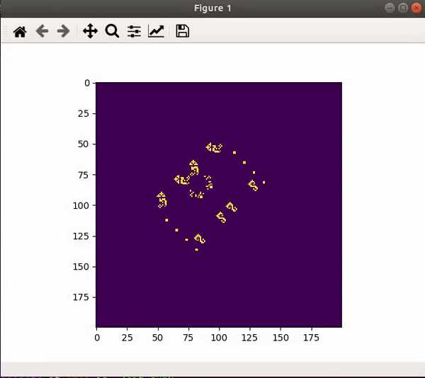

# Solution for Conways way of life task.

Hello, this will contain the .py file for the conways way of life task. Here I have tried to make the code as detailed as possible including a class, some file reading, matplotlib animation, etc. I have also commented the commands in detail and believe it can be understood easily. With regards as to find the number of neighbours I have used the following approach.

so let's take a grid with 0s and 1s where the 0s represent the dead cells and the 1s represent the alive ones. So if we take a 3x3 window, it represents the cell-centered in this window and its neighbors. **Hence since its made of 0s and 1s the sum of the elements in this window will be equal to the total number of alive cells in this window = number of alive neighbors + the cell in the center ( if alive ).**

Hence if we perform the sliding window operation and add all the elements in it and subtract this number from the number in the center we can find the number of alive neighbors in this window. This can be done easily by the operation called as convolution. This is a very common technicque used to handle images in deep learning. It can be easily understood as :


Now how do we use this for our case:


**A one line code to do this operation: ```scipy.signal.convolve2d(grid, np.ones((3, 3)), 'same') - grid```**

Here grid represents our actual grid and the np.ones((3,3)) represents the weight matrix. The convolution returns the total number of alive elements in a window which is subtracted from the center element to find its neighbbours.

**A shorter way to do this.**



**Code for the same [link](conways.py)**


Well the text file for some patterns are basically made of 0s and .'s representing the pattern at some location. So we have defined a ref position from where we draw this pattern and every 0 represents an alive cell in the pattern. Check this part of the code and the text files for a better understanding.

**Some interesting patterns I was able to make.**







