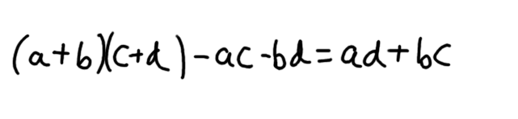

# Some interesting stuff:

## How does Python Multiply two numbers:


Isnt this how we normally multiply two numbers. But the number of computations done here is very high due to the multi additions, products, carry overs, etc. So is this how Python multiples two numbers?

Obiviously not - It uses something called the **karutsba algorithm**. Well what is it?

So lets say we have to multiply two numbers x and y. We can represent x as:


And similarly y as :


Hence the product x*y can be written as :


So we have to make 4 computations to calculate the value of x*y can we reduce this well if we perform (a+b)(c+d) and subtract ac and bd from this we can get ad + bc



Hence the product x*y can be computed using the product of a*c, b*d and (a+b)*(c+d). Now the numbers a,b,c,d are going to be lesser than x and y making our computation easier. But why stop here, what if we did this recursively till we get a,b,c,d as integers of length 1. Now this is called the karatsuba algorithm. 

**A python implementation of the same is added in this folder [link](karatsuba.py)**

## Generators in Python:

Lets say we want to find prime numbers from an input list. We can manually go from the start to the end of the list and return the list of prime numbers from them.

```
def get_primes(input_list):
    return (element for element in input_list if is_prime(element))

def is_prime(number):
    if number > 1:
        if number == 2:
            return True
        if number % 2 == 0:
            return False
        for current in range(3, int(math.sqrt(number) + 1), 2):
            if number % current == 0: 
                return False
        return True
    return False
```

Now lets say we want to find all the prime numbers from 0 to infinity. Now doing this is going to be very difficult as the memory of this large list is going to keep increasing. Now this is primarily because of the fact that the above function get_primes can return a value only once - which is the entire list. What if we could do this multiple times. What if we could check one by one if a number is prime and return that particular value to the call and then go back to the function and resume the operation to the next number. 

This is exactly what a generator does. The below code is used to find the sum of prime numbers till a huge value.

```
def get_primes(start):
    n = start
    while n<20000000000:
        if is_prime(n):
            yield n
        n = n + 1

def is_prime(number):
    if number > 1:
        if number == 2:
            return True
        if number % 2 == 0:
            return False
        for current in range(3, int(math.sqrt(number) + 1), 2):
            if number % current == 0: 
                return False
        return True
    return False

sum_of_prime = sum(get_primes(2))
```
Now whats the difference. Everytime yield is called the function get_primes returns the number to the caller and hence the generator does not need to store them. After the yield command it still remembers the value n and then continues the operation in the function. This can be considered to be analagous to multiple return statements in a function and resuming the operation once the value is returned.

The ```xrange()``` function in python uses a generator to create a huge list.
```
# summing upto a very large number
total = sum(xrange(2000000000)) 
```

## Loops in Python - Comparison and Performance.

So lets try to compare the speed performance in adding two lists element wise.

Creating a list of 100 random integers and creating x and y of size 1000 from them.
```
# creating a list of 100 integers
r = [random.randrange(100) for _ in range(100000)]

# creating x and y of length 1000 randomly sampled from them.
n = 1000
x, y = random.sample(r, n), random.sample(r, n)
```

**Using while loops**: ```%%timeit``` runs the same code multiple times and benchmarks it.
```
%%timeit
i, z = 0, []
while i < n:
    z.append(x[i] + y[i])
    i += 1

-------
Output 
10000 loops, best of 3: 117 µs per loop
```

**Using for loops:**

```
%%timeit
z = []
for i in range(n):
    z.append(x[i] + y[i])

-------
Output 
10000 loops, best of 3: 86.2 µs per loop
```

**Using comprehensions:**

```
%%timeit
z = [x[i] + y[i] for i in range(n)]

-------
Output 
10000 loops, best of 3: 61.7 µs per loop
```

**Using NumPy arrays:** :) obiviously gonna be faster but simply

```
x_arr = np.array(x)
y_arr = np.array(y)

%%timeit
z = x_arr + y_arr

-------
Output 
1000000 loops, best of 3: 784 ns per loop
```

### So what do we see:

**The for loops are faster than while loops by almost 1.4 times.**

**The comprehension methods are faster than for loops by almost 1.4 times again.**

**The numpy array method is almost 80 times faster than the comprehension method.**

### Lets do it once more using nested loops:

Once again we create matrices of size 100x1000 as x and y and we try to add them element wise.

You can check all the code in the notebook [link](benchmark.ipynb)

**Using while loops:**

100 loops, best of 3: 13.5 ms per loop

**Using for loops:**

100 loops, best of 3: 10.6 ms per loop

**Using comprehensions:**

100 loops, best of 3: 8.13 ms per loop

**Using NumPy matrices:**

10000 loops, best of 3: 46 µs per loop

**So once again the same set of speed differences among while loops, for loops and comprehensions. The matrix method is almost 200 times faster than all of them.**

### So what does this tell you always try to vectorise your code whenever possible to make it faster.


## Memory allocation in Python:

In case you haven't read this [link](../Day2/DAY2%20-%20Notebook2.ipynb)

