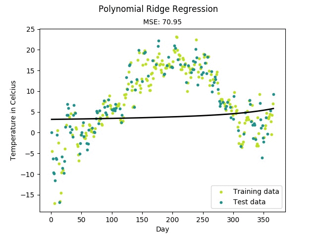
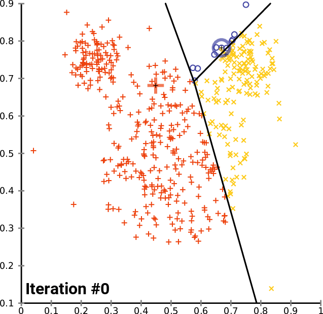
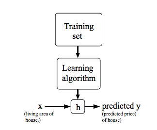

# Introduction to Machine Learning

Before we start lets once again see what AI and Machine Learning is.

Artificial Intelligence means getting a computer to mimic human behaviour in some way.

While some people falsely consider AI a technology, **the more accurate approach would be seeing it as a broad concept in which machines can deal with tasks in a way we would call intelligent or smart.**

So is Artificial Intelligence and Machine learning the same? Not really. Artificial Intelligence is a broader concept while machine learning is a very common application of AI.

We should understand machine learning as a current application of AI that is focused on the development of computer programs that can access data and learn from it automatically, without human assistance or intervention. The entire machine learning concept is based on the assumption that we should give machines access to information and let them learn from it themselves.

For example: If we give computer information about weather patterns for the last few years. The computer can use “machine learning” algorithms to predict the weather condition tomorrow or the day after and so on.

## A formal definition for Machine Learning

**A computer program is said to learn from experience E with respect to some task T and some performance measure P, if its performance on T, as measured by P, improves with experience E.**

WOAH sounds complex? Well, actually not! If there is a computer algorithm which can perform a task ( T ) after learning from some existing data (basically experience E) and if its performance ( P ) improves with more data (more experience) we call it a Machine learning algorithm.

For example:

Suppose we have to teach a computer to play a checkers game. Then the task (T) is to play a checkers game. Now to train the model we should have data of previous checkers games which is going to act as our experience E from which the algorithm learns. Now to evaluate how well the computer plays we keep a performance metric (P) which in this case I define as the probability that the computer wins the game. The computer can learn from the game it has played and further tweak the model to perform better. The process of learning happens over multiple iterations and with each iteration, the model should perform better.

Now let’s try to understand how a machine learning algorithm learns to perform a particular task.

## Supervised and Unsupervised Learning

Every machine learning problem can be assigned into two broad categories — supervised learning and unsupervised learning.

**Supervised Learning**

In supervised learning, we train a model with data which is already labelled or in simpler words we have a dataset which contains information about what the actual output must look like. So once the model learns from this “Training data” it tries to predict the output for a new set of examples by establishing a relationship between the input and output.
For example: Given images with information of what’s on them, we need to recognise new images.
Supervised Learning problems can be further classified into two main categories:

**Regression Problem:**

Whenever we are trying to predict results within a continuous output, meaning we are trying to map some input variables to some continuous function. For example: Given the characteristics of a mobile phone, we need to predict the approximate price of the mobile phone.

**Classification Problem:** 

Whenever we are trying to classify the output into specific categories, meaning we need to map some input variables to output some discrete values. For example: Given an image of an animal, we need to classify into whether its a cat or a dog.

**Unsupervised Learning**

Unsupervised learning is the training of machine using information that is neither classified nor labelled and allowing the algorithm to act on that information without guidance. Here the task of machine is to group unsorted information according to similarities, patterns and differences without any prior training of data.

For example, A computer doesn’t know what the game cricket is and hence the computer can group the players based on some common characteristics like batting style (Right-Handed or Left-Handed), based on whether they are wearing similar kits, etc.

Unsupervised learning can be classified into two categories of algorithms:

**Clustering:** 

A clustering problem is where you want to discover the inherent groupings in the data, such as grouping customers by purchasing behaviour.

**Association**

An association rule learning problem is where you want to discover rules that describe large portions of your data, such as people that buy X also tend to buy Y.

So lets start with supervised learning algorithms and one of the most simple one is the Linear regression algorithm.

## Linear Regression

As the name suggests, a linear regression model tries to map the output variable with the input variable in a linear fashion.

In rather simpler words, a linear regression model assumes a linear relationship between a dependent, continuous variable Y with one or more independent variables called X.

For example, let’s take a case where we want to predict the price of a house given the area in sq.ft.

Here the output Y (the price of the house) is considered to have a linear relationship with the X which is the living area in the house.

Considering the standard form for a line.

**Y (Price) = M * X ( living Area ) + C**

On plotting price along y-axis and size (in ft²) along x, we see the above plot. So the objective in a linear regression model is to fit a straight line onto this given data and try to predict the price of the house given another size.

Now the challenging part to do this is to find the straight line that best fits the given data. As we already know every line is defined by two parameters its slope m and the constant c. So to uniquely define a line which best fits the given data we need to find the optimal value of m and c.

**Note: As we can see from the above plot the “best fit” line need to always pass through every point given in the data and must rather be such that the deviation from these points must be minimal.**

I will leaving it here for now, tomorrow we will better understand how exactly linear regression works and how to implement a simple univariate Linear Regression from scratch.