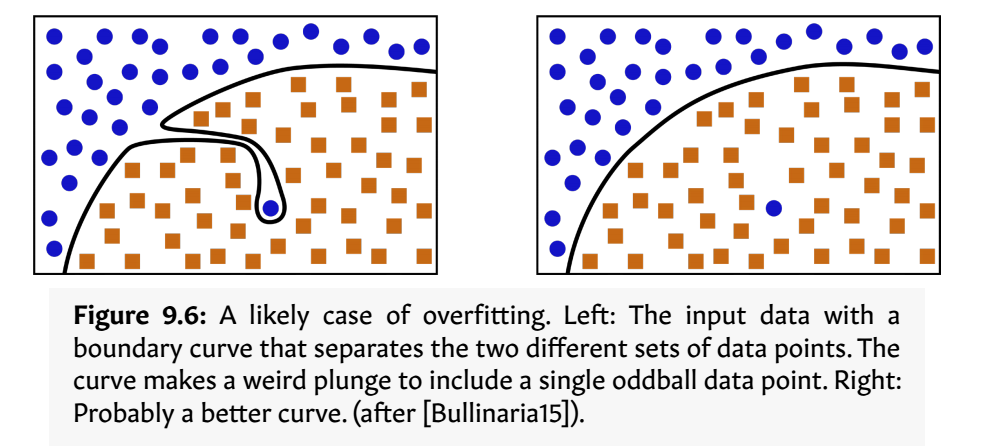
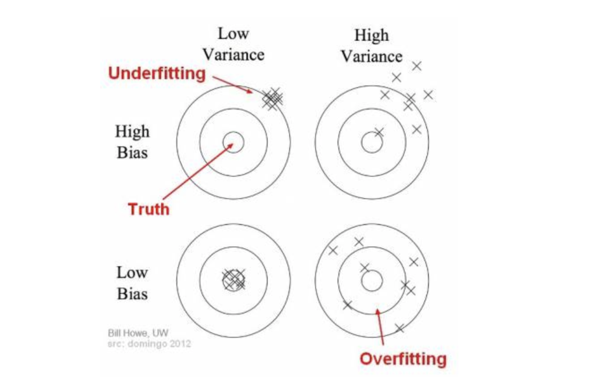

# Training error & Test error
The central challenge in machine learning is that our algorithm must perform well on new inputs- not just those on which our model was trained. The ability to perform well on previously unobserved inputs is called generalization.

Typically, when training a ML model, we have access to a training set; we can compute some error measure on training set, called as training error; and we reduce this training error. Now what seperates machine learning from optimization is that we want the generalization error; also called test error, to be low as well.
Generalization error is defined as the expected value of error on new input.

We typically estimate the generalization error of a ML model by measuring its performance on a test set of examples that were collected seperately from the training set.

# Overfitting and Underfitting
We build ML system to help us extract meaning from data. To help them learn to do this , we usually start with finite set of examples and try to learn general rules from them. But if we don't pay attention to the details of the examples, our rules will be too general, and when we get to working on new data we're likely to come to wrong conclusions.

On the other hand if we pay too much attention to the details of the examples,our rules will be too specific, and again we will be likely to come to wrong decisions.

These phenomena are respectively called underfitting and overfitting. We control overfitting and rein it in with techniques known collectively as regularization.

### Overfitting
When our system learns from the training data too well, and does  poorly when presented with new data, we say that it is overfitting. 

We can take two actions to control overfitting. 
First, using regularization methods, we can encourage the system to keep learning general rules as long as possible, preventing it from slipping into the memorizing of details.  
Second, we can catch when this descent into memorization starts, and stop the learning process at that moment. 


#### Early Stopping
This technique of ending training just as the validation error starts to  rise is called early stopping,

Generally speaking, when we start training our model we’ll be underfitting. The model won’t have seen enough examples to figure out how  to handle them properly, so it’s using first-guess rules that are general and vague. As we train more and the model refines its boundary curve, the training and validation errors will both typically drop. At some point, we’ll find that although the training error is continuing  to drop, the validation error is starting to rise. Now we’re overfitting. From this analysis we can come up with a good guiding principle: `when we start overfitting, stop training.` since we’re stopping our training process before the training error has reached zero. It may be easier to think  of this idea as sensible stopping, since we’re stopping our training  neither too early nor too late in a broader sense, but at just the right  moment when we’ve stopped improving the model’s validation error. 

#### Regularization
One of the other way to prevent overfitting is to give equivalent importance to all the features. So that no feature tend to dominate and we are more likely to generalize things.

Regularization is a method to make sure that no one weight,  or no small set of weights, dominates all the others. `Note that we’re not trying to set all the weights to the same value, which  would make them useless. We’re just trying to make sure they’re all the same ballpark, so no one weight swamps the others.`

We specify the amount of regularization to apply with a parameter λ (lambda), though sometimes other letters are used. This is a hyperparameter/ a parameter that we set externally to our learning algorithm. Most commonly, larger λ means more regularization.

So we can use the regularization parameter λ to  choose how complex we want our boundary to be. High values will give  us smooth boundaries, while low values will let the boundary adapt  more precisely to the data it’s looking at. In other words, low values of  regularization lead to the wiggly overfitting curves we saw earlier, and  larger values of regularization smooth those curves out.

In the later sessions we will be learning about some specialized regularization techniques like dropout and batchnorm that can help control overfitting for the architecture that involves multiple layers of processing.

### Underfitting
When it doesn’t learn well enough from the training data, and does  poorly when presented with new data, we say that it is underfitting.

In contrast to overfitting, which results from using rules that are too  precise, underfitting describes the situation when our rules are too  vague or generic. This is usually much less of a problem than overfitting. We can often cure underfitting just by using more training data.  With more examples, the system can work out better rules for understanding each piece of data. 

### Then what do we expect?
What we want is a solution that’s not trying to match all of the data  exactly, but is getting a good feeling for the general trends. We want  something that’s not too precise a match, or too loose, but “just right.” 

Now let's understand the meaning of terms like bias and variance.

## Bias vs Variance trade off

Bias refers to the error due to the model’s simplistic assumptions in fitting the data. A high bias means that the model is unable to capture the patterns in the data and this results in under-fitting.

Variance refers to the error due to the complex model trying to fit the data. High variance means the model passes through most of the data points and it results in over-fitting the data.

From the above picture we can observe that as the model complexity increases, the bias decreases and the variance increases and vice-versa. Ideally, a machine learning model should have low variance and low bias. But practically it’s impossible to have both. Therefore to achieve a good model that performs well both on the train and unseen data, a trade-off is made.

In the above diagram, center of the target is a model that perfectly predicts correct values. As we move away from the bulls-eye our predictions become get worse and worse. We can repeat our process of model building to get separate hits on the target.


```python

```
