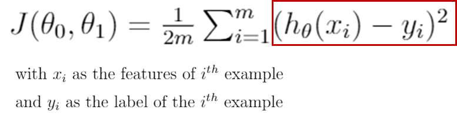
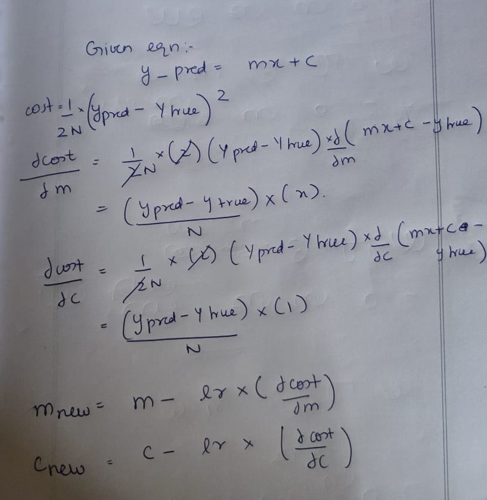

# Linear Regression

So yesterday, you would have got to know what Machine Learning is and also a small intro to what Linear regression is.

Refreshing on what we saw yesterday:

**Regression** : Whenever we are trying to predict results within a continuous output, meaning we are trying to map some input variables to some continuous function. For example: Given the characteristics of a mobile phone, we need to predict the approximate price of the mobile phone.

**Linear regression** :

As the name suggest, a linear regression model maps the output variable with the input variable using a linear function. A simple linear function is of the form ( y = m*x + c ) where x and y are the input and output respectively.

The parameters m and c define the line equation and hence the goal of the model is to find the optimal values of and m and c such that the given data is best fit. Here best fit doesn't mean that every x is exactly mapped to its corresponding y, but rather the model tries to find the best values of m and c such that the error between the predicted and true values is minimum.

Lets consider an example:

Suppose we want to predict the price of a house given its area in sq.ft, we treat the price as Y and the input (Area) as X. 

Hence considering the standard form of the line :

**Y (Price) = m*X(Area) + c**

By finding this line equation, we can predict the price of a house given its area. 

## Cost function:

As mentioned above we need to have a metric that evalautes how well the model fits to the given data. This metric is modelled into a function which we call the cost function. So cost function defines how much the line is deviating from the true values. We need to find the parameters of the line (i.e) m and c such that the cost is minimum.

Now this cost function is modelled as per the user's desire based on the given problem. Since we are modelling a regression problem the simplest way to define the cost function is the mean squared error.

**Mean Squared Error = 1/(2*N)*( y_pred - y_true )^2**

Here N is the total number of points we are trying to fit a line to. y_pred is the predicted values of price outputed from the model. y_true is the true value or ground truth price.

------
**For people who are following Andrew NG's lectures, he models the function as :**

**h(x) ---> Y and the parameters m and c correspond to theta1 and theta0 respectively.**
Hence the cost function is:

------

If the blue line represents the current line, then the arrows depict how much it is deviated from the points in the data.

## How to find the optimal parameters of the line

We have now defined the cost function and hence for every value of m and c, we know the cost/the deviation between the predicted and actual values. Plotting the cost at corresponding values of m and c we get the following graph.

Now we need to find the optimal values of m and c for which the cost is minimum which is at the minima of the above function. We can’t do this in one iteration i.e we can’t find the optimal value of m and c in one step. Instead its a learning process over multiple iterations which finetunes the parameters for minimum cost.

## Gradient Descent — Finding the optimal values of m and c

The method of finding the optimal values of m and c is termed as gradient descent. Now lets try to understand this intuitively.

Let’s imagine a valley where a person at the top has to reach the bottom of it and the person has no clue as to which direction the minima is.

When the person is on the left of the minima, the slope at the point at which he is standing is negative. Now suppose we subtract this negative value from the value of m and c at that particular point we can see that m and c would increase (subtracting a negative value basically adds it) and hence the person would move closer to the minima (i.e) to the right. Similarly, if the person is on the right of the minima the slope at that point is positive and hence by subtracting this positive value from m and c, the person would move towards the minima (i.e) to the left.

Performing this multiple times will help us reach the bottom of this valley and in case of Linear Regression the bottom of the cost function curve ( cost is minimum ). The corresponding values of m and c at this point is the optimal value of m and c.

As the person moves closer and closer to the minima the slope would decrease and the person would take smaller and smaller steps. Hence the person can’t reach the exact minima but go as close as possible to it. Hence the aim of a linear regression model should be to reduce the cost as much as possible but since it can never reach the absolute minima, we can stop training once the cost is saturated. (i.e the model can’t improve further).

## The Gradient descent algorithm:

<<<<<<< HEAD

=======

>>>>>>> f287100b0bc54c0b9efa1ea925d815efbdbf01dd

**NOTE: We need to make sure that the updation of m and c happen simultaneously and not one after the other.**

## Other important things to note

- One can see that we are multiplying by a factor formally called learning rate so that whenever we update the value of m and c we shouldn’t overshoot or cross the minima and move to the other side. For example, if we are at the highest point on the peak the value of the slope at that point is very high and hence there is a high possibility that if we don’t scale down the step size we can overshoot and cross the minima.

- One might ask what is the right value of m and c with which we must start gradient descent. Frankly speaking, there is no ideal value. Instead, one can try different options like start with 0 or randomly initialise the value, etc. This becomes important when our cost function has multiple minima, cause when we start from different positions we can reach a different minimum from there. Ideally, in such a case we need to reach the global minima but there is a high chance we can also reach the local minima. Hence the starting point matters in this case which can be decided by trial and error.

Now lets try to implement a simple univariate Linear Regression from scratch [link](Linear-Regression%20Notebook.ipynb)
