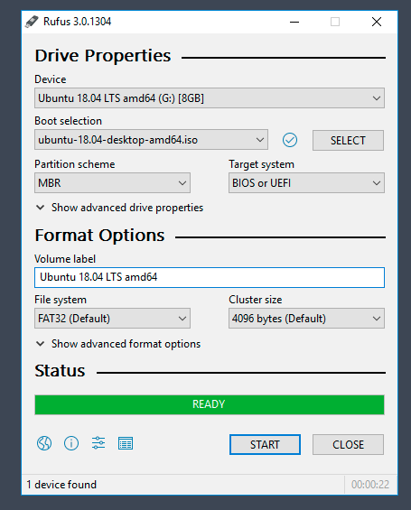
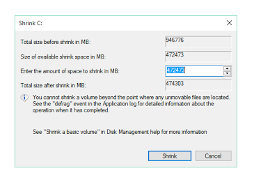
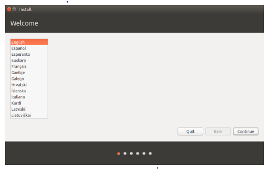
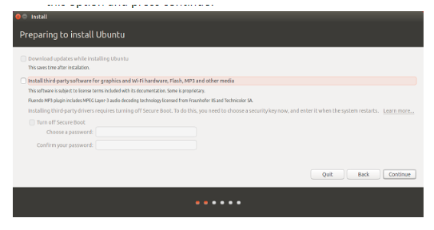
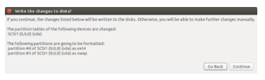
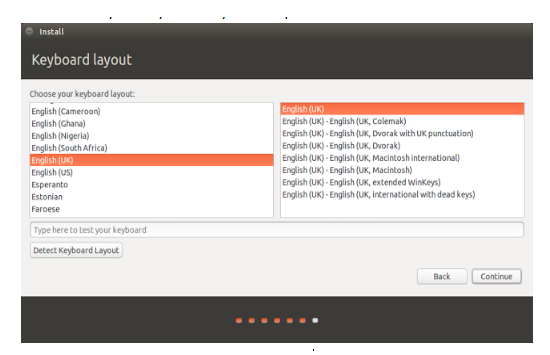
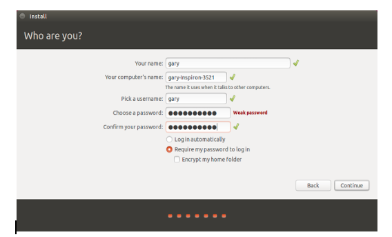
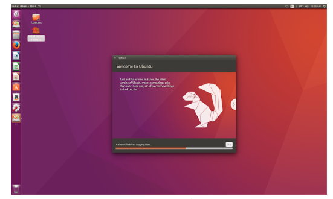
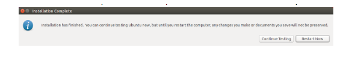

# Dual booting Ubuntu along with Windows

### Downloading Ubuntu ISO file

Open your browser and download the ISO file containing Ubuntu from [here](https://ubuntu.com/download/desktop).
  
**I strongly suggest to use the LTS version of Ubuntu for stable version with Long Term Support.**

### Create Bootable Pendrive 

Once you have downloaded the file create a bootable USB disk. To do that have an empty pendrive (*Note: please backup your files before you format the pendrive*) and flash the ISO file onto the pendrive. To do that install [Rufus](https://rufus.ie/) or any other flashing software.
  
1) After installing the ISO file and Rufus plug in your pendrive. 
   
2) Open Rufus and you should see something like this.

3) Choose your device on the device options and select the iso file on the Boot selection drop down. Next click on start and read all the prompts which open up before continuing. Proceed onto the next steps once the flashing is complete.

### Creating space for Ubuntu

Next we need to create space for Ubuntu. We will do this by opening the windows disk management tool.

1) Start “Disk Management” tool by doing a right click on the Windows start button on the bottom left on the screen and select the “Disk Management” option.

2) Choose the appropriate drive with sufficient storage which you are going to partition and allocate for Ubuntu. Right click on the desired drive and select shrink volume. A window should open as seen.
   

3) Choose the appropriate size to allocate for Ubuntu and then click on the shrink button.
   
### Installing Ubuntu

We need to reboot our PC and load the boot-up menu. To go into the boot-up menu reboot your pc and long press the below mentioned shortcut key. Usually, in most of the machines the boot-up menu comes from “F12” shortcut key, however, in some machines, the boot-up menu appears from “ESC”, “F2”, “F10” key as well. 

Another way to open the boot menu is to go to your **windows settings > recovery and activation tab >** and under recovery click on restart now. Next a page will open up click on **Troubleshoot > Advanced Options > Boot from device > choose your pendrive**.

1) Once the boot-up menu appears, select the option to boot from “USB FLASH DRIVE” and press enter.

2) The booting process will start and once the booting process has been completed you will have an option of how you want to use Ubuntu.

3) Select the “Try Ubuntu” option and press enter.

The Ubuntu live session has been started. You can try the Ubuntu live session but this live session will be destroyed once you restart your machine so to keep it persistent and we have to install the Ubuntu in our hard disk drive.

4) Click on Install Ubuntu. 

1) After clicking the Install Ubuntu option, a wizard will appear and the Ubuntu installation process has been started. 
   

2) Select the language and then press continue.
The next screen asks “Do you want to install latest updates from Ubuntu server” Select this option if you have a decent internet connection else skip this option and press continue.

3) The next screen will ask, “How do you want to install the Ubuntu”. Select the option to install the “Ubuntu alongside windows boot manager” and click on “Install Now”.

4) A window will appear showing what will happen to your disk. Press continue to proceed with the installation.

5) Now the Ubuntu personalization wizard will be started and will ask your location. Select your location and then press continue.

6) Select your keyboard layout and press continue.

7) Next, it will ask the computer name, username and the password to create a default user. Save this password as you will require it in future to use this system. Enter the computer name, username and password and press continue.

8) The setup will start and copy the files from a USB drive to the actual hard disk drive.

9) Once the setup has been completed, it will ask to reboot the system.

**Once the system has been rebooted, you can see that the bootloader will ask which operating system you want to start. Select windows or ubuntu as per your requirement.**

### In case anyone faces any issues please feel free to contact us for help. 