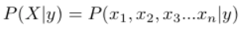
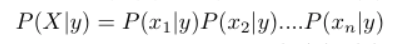
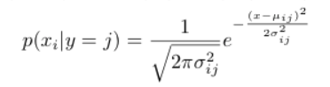

# Naive Bayes Classifier

# Discriminative algorithms vs Generative algorithms:

Discriminative algorithm is one where we try to model P(y|X) i.e probability of y given X.
Generative algorithm is one where we try to model P(X|y) i.e probability of X given y.

Naive Bayes is one of the simplest Generative Learning algorithms which works on Bayes Rule.

### Naive Bayes Assumption
To start, if X=(x1,x2,x3....xn) where x1,x2... represent features of X and y can be one of k classes i.e y belongs to {1,2,3...k}, then

The assumption in Naive Bayes Classifier is that x1,x2,x3.....xn are conditionally independant on y.

Therefore

# So how do we build a classifier using a generative model?

Bayes rule relates P(y/X) with P(X/y) that we have modelled as:
If X={x1,x2,x3......xn} and Y can be one of k classes, then

where

#### Gaussian Naive Bayes

This is done when x1,x2,x3...xn i.e the features of X take continuous real values such as diameter of flower etc.

In such a setting, we can assume that each feature xi for each class y=j comes from a Gaussian distribution whose mean and variance we determine from the training data.
Therefore

P(y=j)= numerator/denominator

where numerator= number of examples in training set with y=j and denominator= total number of examples in training set.
