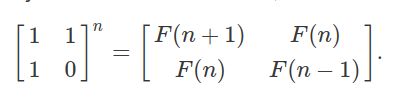
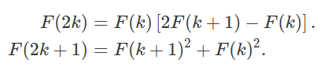
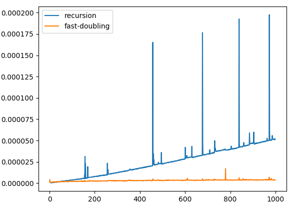

# Task solutions - Day 2 

For Task 1 refer [notebook](Day2_FibonacciTriangle.ipynb)

For Task 2 refer [notebook](Day2_Permutations.ipynb)

In case of Task 1 the calculation of Fibonacci numbers as per the notebook is done by adding the last and the second last element. There are a lot of other advanced algorithms to do this faster.

**Matrix exponentiation method** :

This is a simple identity relating the left matrix with the Fibonnaci sequence. Matrix multiplication is very fast when compared to other techniques but as n increases this increases computation as well.

Hence here comes the **fast doubling method** derived from the matrix exponentation algorithms. 

I have benchmarked the results of calculating the nth Fibonacci number using both these methods. Initially till n = 40 the recurisive method is a bit faster but then the fast doubling algorithm becomes exponentially faster. [code implementation](fibonacci-faster.py)

**Results:**

Thanks to [@NishantPrabhu](https://github.com/NishantPrabhu) for his detailed notebooks.

