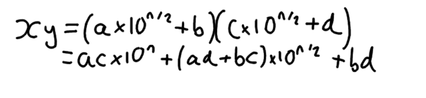

# Some interesting stuff:

## How does Python Multiply two numbers:

Isnt this how we normally multiply two numbers. But the number of computations done here is very high due to the multi additons, products, carry overs, etc. So is this how Python multiples two numbers?

Obiviously not - It uses something called the karutsba algorithm. Well what is it?

So lets say we have to multiply two numbers x and y. We can represent x as:

And similarly y as :

Hence the product x*y can be written as :

So we have to make 4 computations to calculate the value of x*y can we reduce this well if we perform (a+b)(c+d) and subtract ac and bd from this we can get ad + bc

Hence the product x*y can be computed using the product of a*c, b*d and (a+b)*(c+d). Now the numbers a,b,c,d are going to be lesser than x and y making our computation easier. But why stop here, what if we did this recursively till we get a,b,c,d as integers of length 1. Now this is called the karatsuba algorithm. 

A python implementation of the same is added in this folder [link](karatsuba.py)