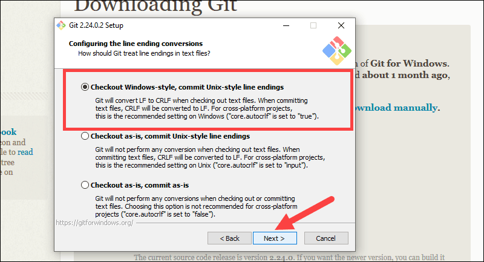

# GIT Command Line Setup on Windows and Linux

## Windows:

-  Browse to the official Git website: https://git-scm.com/downloads
- Click on the installer once the download completes to complete the installation process.

**Some points to note here:**

While going through the installation proceedure make sure to check the following steps. **The remaining can be done as per the recommended ones.**




Next open your command line terminal ( command prompt or the powershell )

- To check your installation write ```git --version```

If installation happened succesfully version number should come on the screen.

- Next to set up your git credentials :
   
  ```git config ––global user.name “github_username”```

  ```git config ––global user.email “email_address”```

------

## Linux:

All you need to do is :

```sudo apt-get install git```

And if you have run the script on the repo you don't need to do this as well and git would have already been installed.

But you still need to setup your git credentials using the commands mentioned above.

## For a quick understanding of Git and its command line usage check out [link](GIT-what_it_is.md)