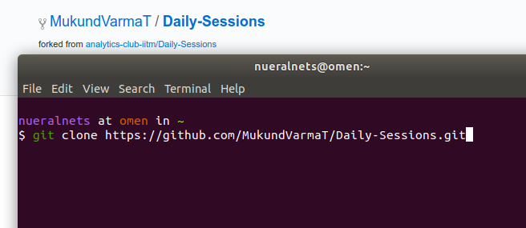
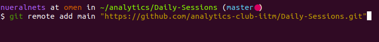

# An illustration showing how we expect you to submit a task for a session.

- Create a GitHub profile.

- Next fork this repository.


- Next clone the forked repository.
  


- Create new file at the required day for the required task.

- Once changes are made. Add and commit to local repository and push to remote.


```git status``` to check changes in local repo.

```git add <file/foldername>``` - to add changes to staging area.

```git commit -m "commit message"``` - to commit staged changes to local repository

```git push origin master``` - to push local changes to online repository.

- Make a pull request from the forked repo.


- Add a message for the pull request and it will read by the maintainers of the repository to choose whether or not to merge the changes.
  
**One useful thing to do is to add another remote as the main repo to the cloned one**

This will help you fetch the changes on the main repo referred to by the remote whenever we move forward by a commit.



After that to fetch the latest changes from the main repository:

```git fetch main master``` - fetches the latest info from the master of the main repo.

```git log --all --oneline --decorate``` - shows the commit log, branches in a tree view.

```git merge main/master``` - merges the fetched changes from the main repo to the local repo.


