### **Exploration of Data --- PCA**

    
     
    <em><a href='https://www.ted.com/playlists/201/art_from_data'>This
may be a random picture for the topic, but given that understanding data
itself is an art form, this artists impression of Jupiter might not be
too far
off.</a></em>

Yes, I know... There are already a bunch of really good articles out
there explaining what
[PCA](https://setosa.io/ev/principal-component-analysis/)
is and what it accomplishes, but let's ignore those for now :). Though,
I will be making my explanations more mathematical and intuitive.

### **The Contents**

1.  Before we begin

2.  Why PCA

3.  How to use it

4.  Why it works

5.  Further exploration

### **Before We Begin**

Let's say that you want to *model the COVID situation in India.* NOPE!
I'm sure you're as done with the topic as I am and hence let\'s take a
different approach. So we shall take a look at the [**[League of Legends
Diamond Ranked Games (10
min)]**](https://www.kaggle.com/bobbyscience/league-of-legends-diamond-ranked-games-10-min)
dataset on Kaggle, where we try to predict which team is going to win
the match after observing the first 10 minutes of the match. *(go play
the game if you haven\'t pl*e*ase).* Now, this dataset has 40 columns,
hence 40 features/variables/attributes, 20 columns of the same feature
but for the two teams, blue and red. For eg: No. of kills by blue team
and No. of kills by the red team.

### **WHY PCA?**

Cleaning up a dataset is a must before we can begin analyzing it since
most datasets have some redundant information and dependant variables.
For eg: You\'re making an excel sheet recording your expenditure and
savings. If you know how much money you began with and how much you've
spent you can figure out how much you have saved. So having three
columns, total\|expenditure\|savings, would be redundant whereas having
only 2 features them will give us all the information we need.
Similarly, we can simplify, clean and represent our data in as few
variables as possible by finding such relations in the features of the
dataset.

Now there seems to be a lot of redundant information in our dataset too.
For example, if the blue team killed a dragon, then clearly the red team
didn\'t, the total amount of gold is proportional to the number of kills
by each team, etc. There is clearly some correlation between a few
variables, but could there also be some correlation between the level of
the player and the number of vision-wards placed by them? The problem
with most datasets is that such relations are not so easily discovered
as in the example above. In addition, we have a ton of features to
consider and hence a lot of relations to discover.

Now, what if we just give the data to the computer as is? Given the
number of relations to consider, your model (and possibly you) might
favour a few relations over the other and overfit to the input, i.e, the
model will try to find patterns it can easily and ignore the finer
details of the data.

For eg: In a study conducted where it was observed that there was a
correlation between Ice-cream sales and Shark Attacks in Australia.
Looking at the data just at its face value, one could find the "sparse
correlation" between the two and conclude and learn the "bias" that one
of them causes the other. When in reality it is the wonders of summer
that leads to such mischief. Summer leads to more shark attacks & also
makes people lusty for ice-creams. Ah! another classical example of
correlation doesn\'t imply causation.

Essentially the people in the previous example gave too much weightage
to growth in ice-creams sales and shark attacks and ignored the
temperature. The correlation is indeed present, but making further
estimates and derivations such as "ice-cream has fat that attracts more
sharks" would be flawed. So going back to the point above, we need to
prevent our computer from favouring or getting "biased" towards a few
features and ignoring the rest.

Now you might be thinking: if people can be dumb, what's stopping a
brainless machine from doing the same? The good thing is that since
they're "brainless" they have no pre-existing bias, and the bias they
learn can be controlled to some extent.

> By "bias", I do not mean the bias term accompanying the weights of a
> neural node, rather how much weightage the computer gives to a few
> features. In the case of a neural network, it could simply set all the
> weights for the preferred features to be extremely high so that the
> end result is more sensitive to these features, and we could say that
> the network is "biased" to those features.

So after highlighting the problem above, you might've guessed that if we
reduce the number of variables (hence the relations), the lesser the
chance for our model to overfit. But how do we choose what variables to
remove and is there any way to meaningfully reduce the number of
variables.

> So the TLDR is that we need to identify relations between features and
> make the data concise by only keeping the minimum required number of
> features.

This process is called **dimensionality reduction**. *A fancy name I
know right!*

Most of the reduction methods can be grouped into 2 categories:

1.  Feature elimination

2.  Feature extraction

**Feature elimination** is what it sounds like: we reduce the number of
features simply by eliminating them. In the League of Legends example
above, instead of considering every single variable, we might drop all
the variables we consider pointless. For eg: we could drop all the
information about the red team on the assumption that if the blue team
was performing well, the red team would be performing poorly. As a
result, we can predict the status of the match on the basis of fewer
features. The advantage of doing this is that it is simple and you
maintain an understanding of your data.

As a disadvantage, though, you gain no information from those variables
you've dropped. Again let's say you drop all of the red team's
information. You would then miss out on their players' statistics and
possibly would not be able to predict the result accurately in the case
when the red-team pulled a sneaky comeback.

**Feature extraction**, however, doesn't run into this problem. Features
extraction is the process of deriving "new" features from "old" ones.
Now, what if instead of dropping all of the red team's information, we
grouped both the teams' information into 20 columns (half). In this
manner, we have information about both teams and we have fewer relations
to consider. But the obvious problem lies in figuring out the right
combination of the "old" features to make these "new" features.

And this is where **PCA**, **Principal Component Analysis**, comes in to
save the day. PCA is one of the many dimensionality reductions methods
but it is a linear model and hence is relatively easy to understand.

PCA essentially tries to find the best linear combinations of our "old"
features to make new independent "principal" features.

Eg: If *A, B, C, D, E, F, G, H, I, J* were our old features, then our
new feature '*a'* would look like

    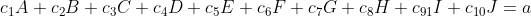
     
    <em>Where c1,c2, etc. are constants</em>

The goal is to convert the given features into linearly independent ones
(one feature cannot be represented as some combination of others) while
preserving information thereby making new "principle features", from
which we drop the least important ones. One drawback is that you now no
longer understand what each variable stands for. Eg: Your initial
features were no. of vision wards deployed by player and level of that
player. But your new feature is now 10\*(level) + 5\*(vision\_wards).
This attribute doesn't make a lot of sense but maybe given the data this
combination holds more value than those two old features separately.

So to summarize:

1.  PCA reduces the number of features.

2.  These new features are independent of each other.

3.  Though, the interpretability of the features is reduced.

Now let's get into the nitty-gritty of PCA, and you might have guessed
since it is all about linear algebra; Matrices are coming.

### ***RECIPE FOR A SWEET & EASY PCA***

If our dataset had 3 features then we could plot all points in 3D space,
where the x,y,z axes would represent the features. The League of Legends
Dataset has 40 features, hence 40D space is required. PCA finds new axes
and the values of the "new" features for every point is obtained by
taking a dot product of each point with it. More in detail later.

    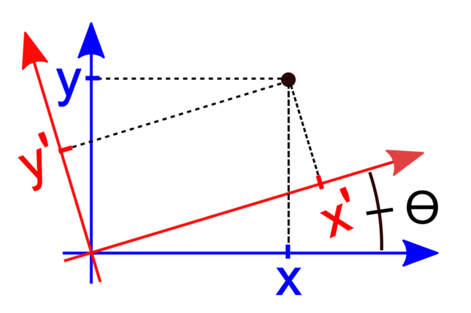
     
    <em>The
blue lines are original axes, red lines represent the new axes</em>

Now let\'s begin

-   >If your data is not already in tabular form, do yourself a favour
    > and make it so. Rows represent different entities(points), while
    > columns represent the value of each feature of that entity.

-   >Find the Covariance Matrix of the features.

-   >Make a matrix using the table above by removing the index column
    > (entity column)

-   >The covariance (K) between any two features (*Xi & Xj*) is:

    
     
    <em>Where E[X] is the expectation
value(mean) of that feature</em>

-   >So our [[covariance
    > matrix]](https://en.wikipedia.org/wiki/Covariance_matrix#:~:text=In%20probability%20theory%20and%20statistics,of%20a%20given%20random%20vector.)
    > would look like this:

-   >To simplify the process. Subtract each value of a column by the mean
    > of that column, to obtain a centralized matrix (all values are
    > centred around the origin).

***OPTIONAL:** We could also divide each value of the column by the
standard deviation of the column to normalize the values (and this
returns the "correlation" matrix). This is done when the importance of
a feature is independent of its variance. For eg: population density.
In a city with more people, the deaths will be more than when compared
to a village with fewer people. Let's say out of 1000 people 100 die
every month in the city and in the village 20 people out of 100 die
every year. And if we were predicting the living standard in different
areas we might get biased and decide that due to more deaths the city
has poorer standards, while in reality, the opposite is true. This
bias can be overcome by "normalizing" the data (there are multiple
ways of normalizing data) but let's say in this case we simply divide
it by the total number of people in the area which reveals that the
proportion of deaths in a village is greater than in the city.*

-   >Then find the transpose of the matrix and multiply that with the
     matrix.

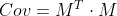

-   >And that's our covariance matrix.

-   >Now comes the fun part. Find the
    > [**[eigenvectors]**](https://mathworld.wolfram.com/Eigenvector.html#:~:text=Eigenvectors%20are%20a%20special%20set,144%29.)
    > and
    > [**[eigenvalues]**](https://mathworld.wolfram.com/Eigenvalue.html#:~:text=Eigenvalue,144%29.)
    > of the **covariance matrix**. There are many libraries that can
    > help you with this step. Numpy is one such library (but be careful
    > about the rounding off errors).

-   >Write the matrix in its eigendecomposition form. (lost?) Make a
    > matrix *Z* whose columns are eigenvectors, *P* which is a diagonal
    > matrix where the values of the diagonals will be eigenvalues. The
    > eigenvalues on the diagonal of *P* will be associated with the
    > corresponding column in**Z **--- that is, the first eigenvalue in
    > the diagonal will be the eigenvalue of the first eigenvector.

-   >Now the *Cov* matrix can be written in its eigendecomposition as:

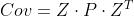

-   >Now sort the eigenvalues in the diagonal of *D* in descending order
    > and accordingly shift the eigenvectors in *Z* to make *Z\*.*

-   >We can do this because our *Cov* matrix is **symmetric** and
    > [**[positive
    > semidefinite]**](https://mathworld.wolfram.com/PositiveSemidefiniteMatrix.html)
    > since it is of the form [***[M\^T.M]***](about:blank).
    > The only important aspect of a positive semidefinite matrix is
    > that its eigenvalues are non-negative, otherwise we needn\'t
    > bother too much with these properties. Though, if you\'re
    > interested you can find more at this
    > [[link]](https://mathworld.wolfram.com/PositiveSemidefiniteMatrix.html).

-   >Was it necessary to write the eigendecomposition? Nope. It was just
    > so that I could sound cool. The important step is to convert the
    > eigenmatrix *Z* to *Z\** because we will use this to drop the
    > least important features (more on that later).

-   >Now to obtain the "new" features. Multiply the centralized (maybe
    > normalized) matrix *M* with *Z\** to obtain the new representation
    > of our data.

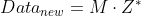

-   >Now we need to choose which "new" features to drop. There are three
    > main ways.

1.  Arbitrarily select the number dimensions. If you want to visualize
     your data in 2D then select the first two features from
     *Data\_new*.

2.  Calculate the [[proportion of variance
     explained]](https://stats.stackexchange.com/questions/22569/pca-and-proportion-of-variance-explained).
     I.e, divide each eigenvalue by the sum of the eigenvalues to find
     the proportion of variance. Pick a threshold, and add features
     until you hit that threshold. (For example, if you want to explain
     80% of the total variability possibly explained by your model, add
     features with the largest explained proportion of variance until
     your proportion of variance explained hits or exceeds 80%.)

3.  Calculate the [[proportion of variance
     explained]](https://stats.stackexchange.com/questions/22569/pca-and-proportion-of-variance-explained)
     by each feature, sort features by the proportion of variance
     explained and plot the cumulative proportion of variance explained
     as you keep more features. (The plot shown below is called a
     [[scree
     plot]](http://ba-finance-2013.blogspot.com/2012/09/scree-plots-interpretation-and.html))
     One can pick how many features to include by identifying the point
     where adding a new feature has a significant drop in variance
     explained relative to the previous feature, and choosing features
     up until that point, i.e, find a point on the plot after where
     there is a significant drop in the proportion of variance
     explained.

According to the scree plot below:

-   If we want about 60% variance explained in the data then we choose
     features till feature 4.

-   If we follow method 3, then the significant variance drop happens
     after feature 2. So we choose the first 2 features.

And in a few easy simple steps, you can now do a PCA for yourself.

> ### <i><ins>Now we come to the hottest topic of 2020</ins></i>

### **WhY Do WE do ThiS BrOo???**

First the Covariance matrix. Why use it? So essentially it is measuring
how one feature is changing according to the other, or rather how it is
related to the other.

Eg: Let's say we had two features in our dataset and If our covariance
matrix looked like this:

It would imply that the two features are independent. *I.e,* one
features value doesn't change according to the other (is independent of
the other)

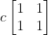
If the covariance matrix was of this form Clearly the two features
depend on each other.

Most of the times our matrix will look nothing like any of these, but
these examples were just to give an intuition of what the covariance
matrix means.

Okay so we obtain a covariance matrix, now what? Where do eigenvectors
come in?

Eigenvectors and Eigenvalues, as the name suggests, represent some
characteristic of a given matrix.

Eigenvectors of a matrix are those vectors which shift from the line
they lie along when multiplied with that matrix but get scaled by the
eigenvalue. For example, if \[1,2\] was the eigenvector of some matrix
and -2 was the eigenvalue, then after multiplication, the vector would
become \[-2,-4\]. It lies on the same line but was scaled by -2.

For further clarification, it is easier to think of matrices as
transformations. Imagine a 2D vector-space (a 2D graph). Using standard
notations. A vector in this vector-space is represented as

Now each subspace (different shapes, i.e, lines, planes that pass
through the origin) has a bunch of vectors, which we call basis vectors,
using linear combinations of which we can plot every point in that
subspace.

For eg: the 2D graph is plotted using basis vectors i and j, where:

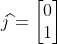

And the basis matrix looks like:

Any point in the 2D space can be written as: r = *x*i + *y*j or

(in this case, different basis vectors would work too, but this is the
simplest one to work with).

Now a linear transformation simply means shifting and scaling, or in
more mathematical terms: finding a new basis matrix through a linear
combination of previous basis vectors (getting a little deja vu? Linear
algebra is all about scaling and adding things up).

This is where matrices come in. Let's say you wanted to simply scale
each point on the graph 3 times. The equations look like:

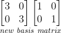

You can see how a matrix is used to represent the change in the basis
matrix. Each linear transformation can thus be viewed in a matrix form.
Eg: A rotation transformation matric looks like

Now each transformation has some characteristic feature. For eg: for a
rotation, it will be the axis of rotation. These features are
represented by the aforementioned Eigenvalues & Eigenvectors.

Eg; Imagine a 3D vector space. Now we want to rotate every point about
the z-axis by 90 degrees. The rotation matrix would look like

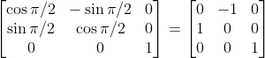

The eigenvectors and eigenvalues of this matrix are:

The columns represent the Eigenvectors

The diagonal elements corresponding to Eigenvalues.

We can see that the Z-axis \[0,0,1\] is an eigenvector and 1 is the
corresponding eigenvalue. This represents that the Z-axis remains
untouched after applying the transformation (no change in magnitude and
direction). This makes sense intuitively because the axis of rotation,
which is the Z-axis, should remain as it is during a rotation.

A few examples to highlight the use of eigenvector in data science:

Take a transformation matrix where all points on a 2D plane are brought
onto a line. (Which means our matrix is
[[singular]](https://mathworld.wolfram.com/SingularMatrix.html),
i.e, two columns are dependant.)

Its eigenvectors and eigenvalues are as follows:

This transformation brings every point on the *xy* plane onto the line
*x* = *y*, which is represented by the vector \[1,1\] and whose normal
is \[1,-1\], which are our eigenvectors, and we can also see that the
eigenvalues are \[2,0\] respectively. One way to look at the eigenvalues
is that they attribute the importance of each direction given by the
eigenvectors. All points on the line *x* = -y are brought to the origin
and their information is lost and hence an eigenvalue of zero can be
interpreted as the loss of information, whereas points on the line *x* =
*y* get magnified and hence an eigenvalue of 2.

Let's take the situation where the matrix columns are independent:

Its eigenvectors and eigenvalues are as follows:

The eigenvectors lie along the original axes, signifying that the
transformation maintains the independence on the original basis vectors.

The key factor to take away is that eigenvectors provide new basis
vectors which can be used to plot every single point in the new
transformed space, and eigenvalues show which amongst the eigenvectors
provide the most information.

### **COMING BACK TO PCA**

Depending on the number of features, i.e, the dimensions of the
covariance matrix, the eigenvectors try to find the best possible
subspace:

Let's say that we have two features. Imagine a 2D plot where the axes
represent the different features. This implies that the subspace of
maximum dimensions is a line (in 3D it would be a plane and so on). Now
if our features were perfectly correlated then there would be a straight
line going through each point. Since this point represents the relation
of the two features the eigenvectors would lie along this line (and the
normal, but like in the previous example the important one would be the
line of correlation). Similarly in the 3D case, if the features were
correlated the eigenvectors would try to find the plane in which all
points lie.

**For example:**

-   Let\'s say all your points lie on the line: y = 3x

-   Your shifted matrix will represent one column is 3 times the other.

-   And the relationship will be represented in the covariance matrix
    > which looks like:

-   Our eigenvectors look like:

-   And eigenvalues:

-   We get eigenvalues like these because our covariance matrix
    > encapsulates the spatial orientation of our data. If you imagine
    > the columns of the covariance matrix as the axes, you can see that
    > one feature, i.e one axis is 3 times the other.

-   So deriving from the examples above, since the features are
    > dependant, our eigenvector lies along the line y=3x

    
     
    <em>The eigenvector of importance lies along
the line</em>

-   The plot below shows the eigenvectors of a randomly generated
    > dataset, where the yellow vector is the one with the highest
    > eigenvalue. One can think of the yellow vector as the one being
    > closest to the line of best fit.

Now, why are we multiplying the centralized data with the selected
eigenvectors? Multiplication is essentially a dot product of each row in
matrix 1 and column of matrix 2. So what we're doing is taking a dot
product of each point with every eigenvector. This returns the values of
the 'new' features which we can use to plot our point in the new space.
The picture below elaborates on the point.

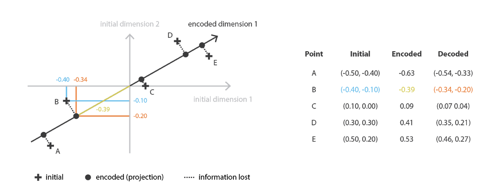

-   Let\'s reduce our randomly generated dataset to a single dimension.

-   Since the yellow vector had the highest eigenvalue (hence the
    > highest proportion of variance explained. Take a look at the scree
    > plot). We shall drop the purple vector.

    
     
    <em>The Scree Plot</em>

-   Now we take a dot product of each point along with the yellow vector
    > and place them on the x-axis according to the value of the dot
    > product. The result is the graph below where the small points
    > represent the 1D representation of the data and the big points
    > represent the 2D representation.

-   To highlight the dot product: The yellow point which is almost
    > perpendicular to the vector is close to the origin, while the
    > green and red points are acutely angled and hence lie in the
    > positive region, while the blue and the purple lie in the negative
    > region.

If the features quite impossibly happen to be independent the
eigenvectors will lie along with the 'old' features, i.e the axes. This
implies the data is already represented in the best way possible and
doesn't need to be transformed.

> Though most of the times our data will be neither highly correlated
> nor independent, our eigenvectors will still find the best fit
> subsoace (line/plane depending on dimensions) to project the points
> onto. And since our eigenvectors are orthogonal, the new principal
> feature will be orthogonal too. Since our eigenvector are
> perpendicular to each other, the new axes which lie along these
> eigenvectors will be perpendicular too.

The dot product between the eigenvectors and our centralized data is
just the application of the formula:

This can be seen in the following example:

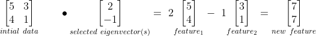

The two features were scaled by 3 and -1 respectively and combined to
obtain our new feature, thereby preserving information and reducing
dimension.

And that's how we use linear algebra to find new principal components in
the data to de-noise and clean the data and also reduce dimensions.

### **Further exploration**

One drawback is that PCA can only find linear relations. If our data
was, say circular then PCA would have a hard time finding good principal
components.

Poor
PCA ;(

One solution to that would be to use neural networks. Since we are
trying to find the best-fit combinations to find new features, what if
we just asked a neural network to find it. Also, the equation to find
new feature looks a lot like the activation of a node in a neural
network from the previous layer inputs. Look up
[Autoencoders](https://www.jeremyjordan.me/autoencoders/)
to find out more.

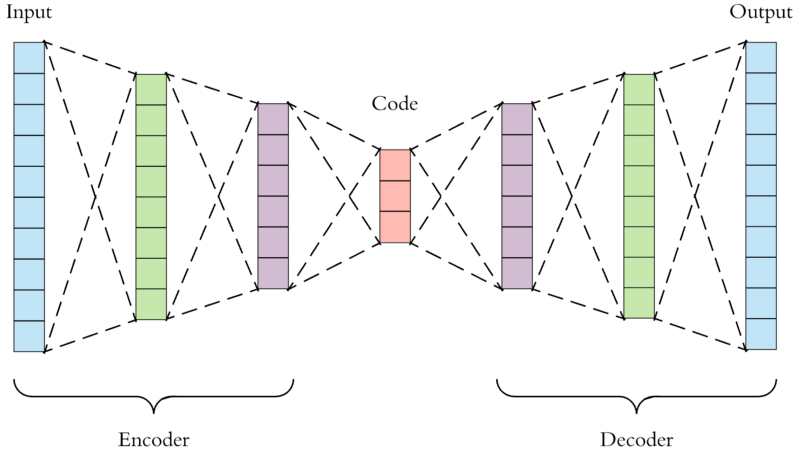AUTOENCODERS

[T-SNE](https://towardsdatascience.com/an-introduction-to-t-sne-with-python-example-5a3a293108d1)
& [UMAP](https://pair-code.github.io/understanding-umap/)
are newer ways for dimensionality reduction and clearing up the data.

### **Resources**

1.  [https://towardsdatascience.com/a-one-stop-shop-for-principal-component-analysis-5582fb7e0a9c](https://towardsdatascience.com/a-one-stop-shop-for-principal-component-analysis-5582fb7e0a9c)

2.  [https://www.youtube.com/playlist?list=PLZHQObOWTQDPD3MizzM2xVFitgF8hE\_ab](https://www.youtube.com/playlist?list=PLZHQObOWTQDPD3MizzM2xVFitgF8hE_ab)
    - (I am no Grant Sanderson, so if you want a better explanation
     about what I talked about check out this amazing Linear Algebra
     playlist by 3Blue1Brown)

3.  [https://www.jpl.nasa.gov/spaceimages/details.php?id=pia21983](https://www.jpl.nasa.gov/spaceimages/details.php?id=pia21983)

4.  [https://en.wikipedia.org/wiki/Rotation\_of\_axes](https://en.wikipedia.org/wiki/Rotation_of_axes)

5.  [https://www.kdnuggets.com/2019/01/dr-data-ice-cream-linked-shark-attacks.html\#:\~:text=According%20to%20the%20data%2C%20ice,is%20linked%20to%20shark%20attacks.&text=So%20the%20good%20news%20is,indeed%20predictive%20of%20one%20another.](https://www.kdnuggets.com/2019/01/dr-data-ice-cream-linked-shark-attacks.html#:~:text=According%20to%20the%20data%2C%20ice,is%20linked%20to%20shark%20attacks.&text=So%20the%20good%20news%20is,indeed%20predictive%20of%20one%20another.)

6.  [https://sitacuisses.blogspot.com/2011/12/dilbert-gets-correlation-causation.html](https://sitacuisses.blogspot.com/2011/12/dilbert-gets-correlation-causation.html)

7.  [https://towardsdatascience.com/applied-deep-learning-part-3-autoencoders-1c083af4d798](https://towardsdatascience.com/applied-deep-learning-part-3-autoencoders-1c083af4d798)

8.  [https://setosa.io/ev/principal-component-analysis/](https://setosa.io/ev/principal-component-analysis/)
