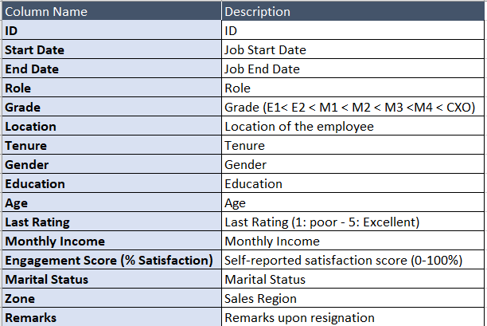

# Visualisation Challenge

Hey Guys, as per the poll results we are going to have the visualisation challenge.

A dataset ([data.csv](./data.csv)) is included in this folder which contains employee data who left the company between 4/2012 and 3/2015. The meaning of each of the column names in mentioned in the figure below.

The aim of this challenge is to help everyone get a flavour of what it is to be a data scientist. One of the main roles of a data scientist is to provide insights from raw data.

## Instructions:

All of you can work individually or in teams, we dont have any issues with that. We want you to be as creative as possible and not do what every one else is doing. One might feel that the dataset directly doesn't contain any information but I know for a fact that some very interesting insights can be drawn from this. 

**We request everyone to come up with any number of visual insights - like graphs and provide a suitable inference and use case for the same. There is no need to come up with Predictive models or analysis but you can do the same if you are interested as well.** 

Everyone needs to submit their insights in a **PDF form and also submit a jupyter notebook** for the same with the relevant code as a **pull request** which will later be compiled together and shared with everyone once the challenge ends. **Mention the name of the PDF file as the members of the team.**

Also, I wanted to know if you guys would like a session after the challenge where you can share your insights and I can share mine as well. Please do fill this poll to share your opinion. [link](https://forms.gle/i49dbDvE5nJjyCi56)